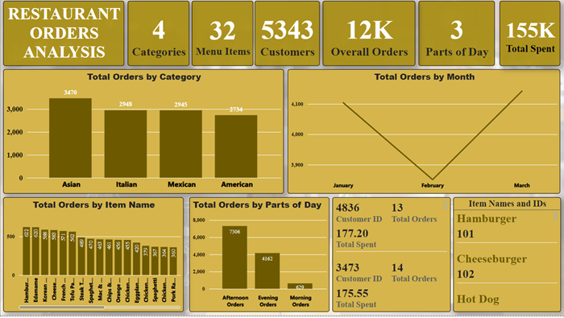

### **Restaurant Orders Analysis**

This project was accomplished using Microsoft PowerBI. 

The original data can be found in the **data** folder

PowerBi was primarily used for the following and steps taken were;
- Data loading and transformation using PowerQuery
    - *Changing data types.*
    - *Data cleaning.*
    - *Feature Engineering*: **Creation of parts_of_day and quarter using PowerQuery**.
- *Feature engineering using DAX*: Creation of **Total Price Per Customer** (A calculated Measure).

```
Total Price Per Customer = 
SUMX (
    SUMMARIZE (
        order_details,
        menu_items[menu_item_id],
        order_details[order_id],
        "Total Orders", COUNT ( order_details[order_id] ),
        "Total Price", SUM ( menu_items[price] )
    ),
    [Total Price]
)
```

- Creation of model relationships: 
    - **One to many relationship** between menu_items and order_details using **menu_item_id and item_id**
    
    **All Cross-filter directions was set to both to ensure that any filter and slicer could be applied in both directions.**

- Exploratory data analysis. 
- Plotting of visuals which were uniform and easy on the eyes and straightforward for viewing by the audience.
- Drawing observations and conclusions from visualisations.

Please kindly check **pbip folder** for the powerbi file.

### **Some images from PowerBI**

 


### **Conclusion**
Questions posed;
- What were the least and most ordered items? What categories were they in? 
    - The most ordered item is Hamburger and it belongs to the American category.
    - The least ordered item is Chicken Tacos and it belongs to the Mexican category
 
- What do the highest spend orders look like? Which items did they buy and how much did they spend?
    - The highest spent is $177.20 and has a total of 13 orders, items purchased were; *Hamburger, Veggie Buger, Mac & Cheese, Tofu Pad Thai, Korean Beef Bowl, Edamame, Chicken Burrito, Steak Torta, Spaghetti, Fettuccine Alfredo, Meat Lasagna, Shrimp Scampi.*

- Were there certain times that had more or less orders?
    - January and March had more orders than February
    - More orders were made in the Afternoon and Evening

- Which cuisines should we focus on developing more menu items for based on the data?
    - Based off the top 10 high spenders, the Italian category has a the highest potential and should be explored and expanded upon in order to attract more customers.
    - Moreover, afternoon has the most potential for orders

- Why does February have a dip in orders?
    - This is something that should be investigated further once more data is presented. 
    - It only had 1675 customers make orders leading to a drop in sales.